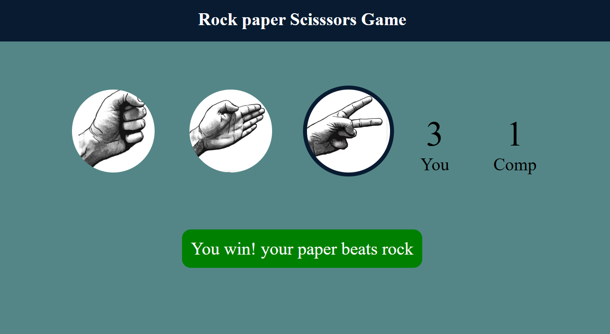
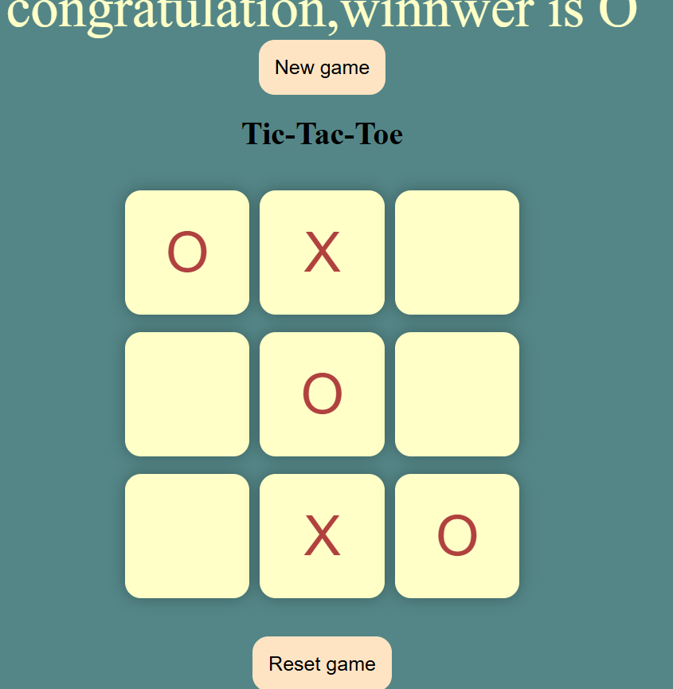

# 🎮 Mini Web Games
This project contains two fun and interactive browser-based mini-games built using **HTML**, **CSS**, and **JavaScript**.  
Each game runs directly in your browser — no installation or downloads required!
---
## 🪨 Rock Paper Scissors
Challenge the computer in a simple and classic game of **Rock, Paper, Scissors**.  
The computer randomly chooses one option, and your score updates based on the result.
**Features:**
- Interactive UI with hand icons 🖐✊✌️  
- Dynamic score counter for player and computer  
- Displays who wins each round  
**Screenshot:**  

---
## ❌ Tic Tac Toe
The classic **two-player game** of X's and O's — try to align three in a row to win!  
You can play against another person on the same device.
**Features:**
- Clean and simple board layout  
- Displays the winner or draw message  
- "New Game" and "Reset" buttons for replay  
**Screenshot:**  

---
## 🧩 Tech Stack
- **HTML5** – Game structure and layout  
- **CSS3** – Styling and visual design  
- **JavaScript (Vanilla JS)** – Game logic and interactivity  
---
## 💡 How to Run
1. Open the folder for any game (rock-paper-scissors or tic-tac-toe).
2. Double-click the `index.html` file to open it in your browser.
3. Play and enjoy 🎉
---
## 🏁 Future Improvements
- Add AI difficulty levels for Rock Paper Scissors  
- Add a single-player computer mode for Tic Tac Toe  
---
⭐ **If you like this project, give it a star on GitHub!**
